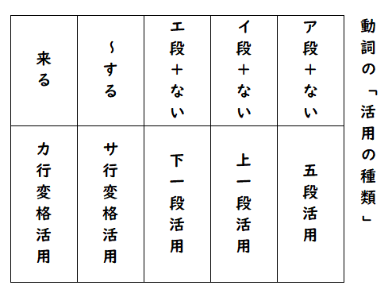
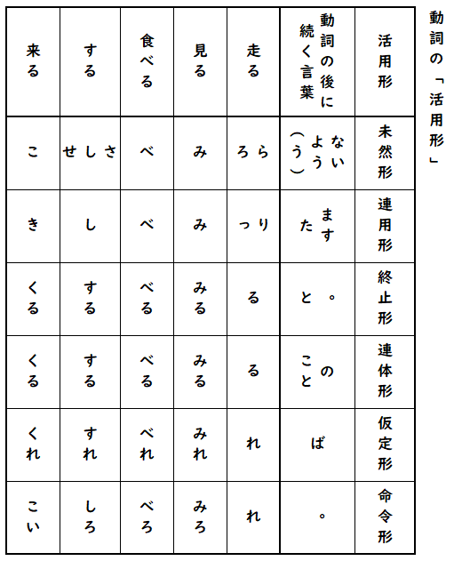
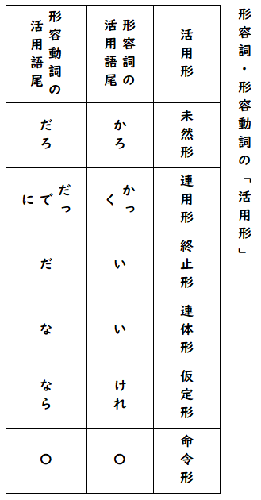

# 動詞の活用形

## 目次

1. [活用の種類](#活用の種類)
2. [動詞の活用形](#動詞の活用形)
3. [形容詞・形容動詞の活用形](#形容詞形容動詞の活用形)

---

## 活用の種類

動詞の活用の種類は次の５つです。

1. **五段活用**（五）
2. **上一段活用**（上一）
3. **下一段活用**（下一）
4. **サ行変格活用**（サ変）
5. **カ行変格活用**（カ変）

五段活用、上一段活用、下一段活用の三つは動詞の下に「ない」をつけることで見分けることができます。

**「ない」の前の文字が、ア段になったら五段活用、イ段になったら上一段活用、エ段になったら下一段活用です。**

| 例 | 説明 |
|---|---|
| ①「走る」＋「ない」＝「走らない」 「走ら**ァー**ない」 | ア段なので、五段活用 |
| ②「見る」＋「ない」＝「見ない」 「見**ィー**ない」 | イ段なので、上一段活用 |
| ③「食べる」＋「ない」＝「食べない」 「食べ**ェー**ない」 | エ段なので、下一段活用 |
| ④「する」（「愛する」「勉強する」「運動する」「練習する」などのように「〜する」という動詞） | サ行変格活用 |
| ⑤「来る」 | カ行変格活用 |

### 注意点

**五段活用の動詞は可能動詞になると下一段活用になる**ので注意が必要です。

> ※可能動詞は「〜できる」という意味の動詞です。

| 例 | 説明 |
|---|---|
| 走る | 「走ら**ァー**ない」→ ア段なので、五段活用 |
| 走れる（可能動詞） | 「走れ**ェー**ない」→ エ段なので、下一段活用 |

**自動詞と他動詞も活用の種類が変わる**ので気をつけましょう。

> ※他動詞は他に働きかける動詞、自動詞はそれ自身の働きを表す動詞です。

| 動詞 | 説明 |
|---|---|
| 崩す（他動詞） | 崩さ**ァー**ない → ア段なので、五段活用 |
| 崩れる（自動詞） | 崩れ**ェー**ない → エ段なので、下一段活用 |

> 焦らずに、もとの動詞は何かをしっかり考えてから問題を解きましょう。

---

## 動詞の活用形

活用形は次の６つです。

1. **未然形**（未）
2. **連用形**（用）
3. **終止形**（終）
4. **連体形**（体）
5. **仮定形**（仮）
6. **命令形**（命）

動詞は続く言葉によって語尾が変化します。活用形を見分けるときは、**動詞の後につく言葉**を見ます。

**「ない、よう」「ます、た」「。、と」「の、こと」「ば」は覚えましょう。**

### 練習問題

**（問1）ジュースを買いに行かせる。**

「行か」の活用形は何でしょうか。後に「せる」が続いていますが、表に「せる」はありません。

「行く」を表に当てはめてみましょう。「行か」に変わるのは、「ない」に続くときだけですね。したがって、**未然形**だということがわかります。

---

**（問2）辛いものも食べられる。**

「食べ」の活用形は何でしょうか。

「食べる」を表に当てはめてみると、「食べない」「食べます」と、未然形も連用形もどちらも「食べ」になり見分けがつきません。

こういう場合は**見分けがつく他の動詞に置き換えて**考えてみましょう。「食べる」の代わりに「来る」を入れてみると、「来（こ）られる」になります。したがって、**未然形**だということがわかります。

- 「来る」が「**こ**」になったら「来ない」と同じなので**未然形**
- 「来る」が「**き**」になったら「来ます」と同じなので**連用形**

---

## 形容詞・形容動詞の活用形

形容詞、形容動詞は動詞と違って活用が一種類だけなので、どのように活用するかを覚えておけば大丈夫です。

### 形容詞「美しい」

「美しかろう」「美しかった」「美しくなる」「美しい。」「美しい町」「美しければ」のように活用します。

### 形容動詞「静かだ」

「静かだろう」「静かだった」「静かである」「静かになる」「静かだ。」「静かな町」「静かならば」のように活用します。

「静かだ」は「静かです」のように丁寧語にしても一語の形容動詞になります。

「静かでしょう（未然形）」「静かでした（連用形）」「静かです。（終止形）」のように活用します。

### 練習問題

**（問）くさいから食べたくない。**

「くさい」の活用形は何でしょうか。

形容詞は終止形も連体形も「〜い」になるので見分けがつかない時があります。そんな時は、動詞の活用形と同じように、**見分けがつく別の言葉を代入して**考えます。

- 形容動詞「静かだ」を入れてみると「静か**だ**から」になる → **終止形**
- 代入してみて「静か**な**」に変わったら → **連体形**

### 参考動画

- [①辞書形・②ます形・③て形｜動詞活用・３種類｜みんなの日本語｜第１〜２５課・動詞(全)](https://www.youtube.com/watch?v=zbuw5Xfpan4)
- [Nai-form｜みんなの日本語｜第２６〜５０課の動詞・全｜ます形→ない形](https://www.youtube.com/watch?v=QNN8Mca9Ti8)