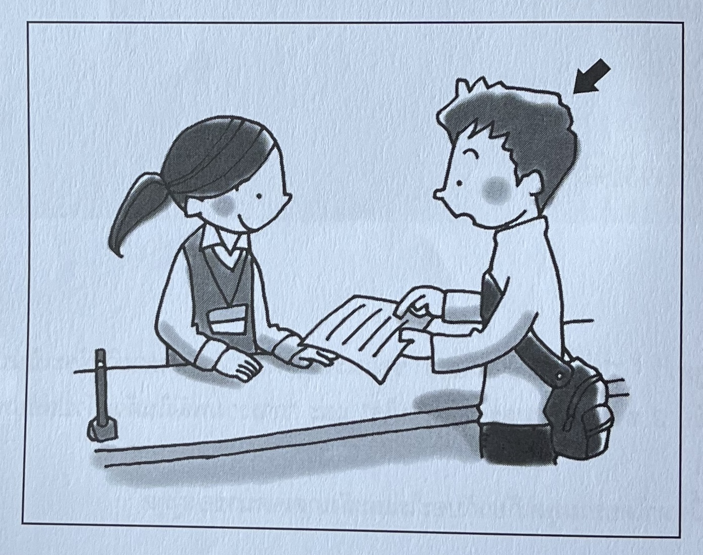

# N3 聴解テキスト（12〜21ページ）文字起こし

---

## 12ページ — 1 話の要点（題意）の把握

### ⭐ 例題 1（A 01）

この問題(もんだい)では、まず質問(しつもん)を聞(き)いてください。それから話(はなし)を聞(き)いて、問題用紙(もんだいようし)の１から４の中(なか)から、最(もっと)もよいものを一(ひと)つえらんでください。

**選択肢**

1. 写真(しゃしん)を準備(じゅんび)する  
2. 原稿(げんこう)を直(なお)す  
3. 発表(はっぴょう)の練習(れんしゅう)をする  
4. 漢字(かんじ)の読(よ)み方(かた)を確認(かくにん)する  

---

## 13ページ — スクリプト（例題1）

日本語(にほんご)のクラスで女(おんな)の先生(せんせい)が発表(はっぴょう)の準備(じゅんび)について話(はな)しています。男(おとこ)の学生(がくせい)はまず何(なに)をしなければなりませんか。

**女：** 先週(せんしゅう)お話(はな)ししたように、あさっての授業(じゅぎょう)では発表(はっぴょう)をしてもらいますから、準備(じゅんび)しておいてください。

**男：** 発表(はっぴょう)の時(とき)パソコンを使(つか)ってもいいですか。写真(しゃしん)を見(み)せたいんですけど。

**女：** いいですけど、リーさんはまだ原稿(げんこう)ができていないでしょう？ 写真(しゃしん)だけでは発表(はっぴょう)になりませんよ。すぐにやって、見(み)せてください。

**男：** はい。書(か)き直(なお)すのはまとめのところだけでいいですか。

**女：** ええ、そこがちょっとわかりにくいので、もう少(すこ)し直(なお)さないと。ほかの準備(じゅんび)は原稿(げんこう)が完成(かんせい)してからでいいです。それから、あしたはグループで発表(はっぴょう)の練習(れんしゅう)をするので、漢字(かんじ)の読(よ)み方(かた)も確認(かくにん)してきてくださいね。

**問い：** 男(おとこ)の学生(がくせい)はまず何(なに)をしなければなりませんか。

### 解答

**正解：** 2（原稿を直す）

### 解説

質問は「まず（最初に）」と聞いているので、最初にやることを選ぶ。先生は「まだ原稿ができていない」と言ったうえで「すぐに書いて見せて」と言い、学生は「はい」と応じ、「まとめのところだけ書き直せばいいですか」と確認している。したがって、他の準備（写真・発表の練習・漢字の確認など）より先に、**原稿を書き直す／完成させる**ことが求められている。  
※ 何をすべきかを示す表現（指示・依頼）に注目し、相手がそれに同意しているかも考える。

---

## 14ページ — 2 要点の把握

### ⭐ 例題 2（A 02）

この問題(もんだい)では、まず質問(しつもん)を聞(き)いてください。そのあと、問題用紙(もんだいようし)を見(み)てください。読(よ)む時間(じかん)があります。それから話(はなし)を聞(き)いて、問題用紙(もんだいようし)の１から４の中(なか)から、最(もっと)もよいものを一(ひと)つえらんでください。

**選択肢**

1. アルバイトがあるから  
2. 子供(こども)の世話(せわ)をするから  
3. 友達(ともだち)の結婚式(けっこんしき)に行(い)くから  
4. 週末(しゅうまつ)は休(やす)みではないから  

---

## 15ページ — スクリプト（例題2）

女(おんな)の人(ひと)と男(おとこ)の人(ひと)が話(はな)しています。男(おとこ)の人(ひと)はどうして飲(の)み会(かい)に行(い)けませんか。

**女：** 渡辺(わたなべ)君(くん)、あしたの飲(の)み会(かい)、行(い)く？

**男：** あー、行(い)こうと思(おも)っていたんだけど……。

**女：** あ、アルバイトの日(ひ)か。

**男：** それは前(まえ)から休(やす)みもらってたからいいんだけど。あしたはさ、姉(あね)の子供(こども)を預(あず)かってほしいって頼(たの)まれちゃってね。友達(ともだち)の結婚式(けっこんしき)に行(い)くからって。

**女：** お兄(にい)さんはいないの？

**男：** うん、いつもなら週末(しゅうまつ)は休(やす)みなんだけど……。子供(こども)が1人(ひとり)じゃかわいそうだよね。

**女：** ふうん。大変(たいへん)そうだけど、頑張(がんば)ってね。

**問い：** 男(おとこ)の人(ひと)はどうして飲(の)み会(かい)に行(い)けませんか。

### 解答

**正解：** 2（子供の世話をするから）

### 解説

「アルバイト」は、男性が「いい（問題ない）」と言っており、飲み会に行けない理由ではない。正解は 2。姉は「友だちの結婚式に行くから」子どもを預かってほしいと頼んでおり、**子どもの世話をするのは話している男性本人**である。結婚式に行くのは姉、といった具合に、選択肢の語が話に出てきても、**誰の話か**を区別する。  
※ 選択肢と同じ語・同じ意味の語が出たら、話し手がその話題について何を伝えたいか（肯定・否定）を考える。

---

## 16ページ — 3 話のあらまし・構成の把握

### ⭐ 例題 3（A 03）

この問題(もんだい)では、問題用紙(もんだいようし)に何(なに)もいんさつされていません。この問題(もんだい)はぜんたいとしてどんな内容(ないよう)かを聞(き)く問題(もんだい)です。話(はなし)の前(まえ)に質問(しつもん)はありません。まず話(はなし)を聞(き)いてください。それから、質問(しつもん)と選択肢(せんたくし)を聞(き)いて、1から4の中(なか)から、最(もっと)もよいものを一(ひと)つえらんでください。

---

## 17ページ — スクリプト（例題3）

テレビで女(おんな)の人(ひと)が話(はな)しています。

**女：** 試験(しけん)の時(とき)などに、緊張(きんちょう)してしまって困(こま)ったことはありませんか。そんな時(とき)に役立(やくだ)つ、いくつかのやり方(かた)をご紹介(しょうかい)しましょう。ある人(ひと)は、緊張(きんちょう)しているときに「お父(とう)さん、ありがとう。お母(かあ)さん、ありがとう」とほかの人(ひと)への感謝(かんしゃ)を心(こころ)の中(なか)で言(い)うと、落(お)ち着(つ)けるそうです。また、体(からだ)に一度(いちど)ぐっと力(ちから)を入(い)れて、その後(あと)力(ちから)を抜(ぬ)くと、落(お)ち着(つ)けるという人(ひと)もいます。一度(いちど)試(ため)してみてはいかがですか。

**問い：** 女(おんな)の人(ひと)は何(なに)について話(はな)していますか。

**選択肢**

1. 人(ひと)が緊張(きんちょう)する理由(りゆう)  
2. 落(お)ち着(つ)くための方法(ほうほう)  
3. 両親(りょうしん)への感謝(かんしゃ)の伝(つた)え方(かた)  
4. 力(ちから)の入(い)れ方(かた)と緊張(きんちょう)の関係(かんけい)  

### 解答

**正解：** 2（落ち着くための方法）

### 解説

「ご紹介しましょう」と述べており、緊張したときに役立つ「いくつかのやり方」を紹介するのが主題である。したがって 2。心の中の感謝や、力を入れてから抜く、はあくまで**落ち着くための方法の例**である。  
※ 全体として何について話しているか、話し手の意図に注目する。

---

## 18ページ — 4 表現の選択

### ⭐ 例題 4（A 04）

この問題(もんだい)では、えを見(み)ながら質問(しつもん)を聞(き)いてください。やじるし（→）の人(ひと)は何(なん)と言(い)いますか。1から3の中(なか)から、最(もっと)もよいものを一(ひと)つえらんでください。

---

## 19ページ — スクリプト（例題4）

大学(だいがく)で事務(じむ)の人(ひと)に書類(しょるい)の書(か)き方(かた)を聞(き)きます。何(なん)と言(い)いますか。

1. **男：** あの、この書類(しょるい)の書(か)き方(かた)、教(おし)えてもよろしいでしょうか。  
2. あの、この書類(しょるい)の書(か)き方(かた)、教(おし)えていただきたいんですけど。  
3. あの、この書類(しょるい)の書(か)き方(かた)、教(おし)えていただきましょうか。  

### 解答

**正解：** 2（教えていただきたいんですけど）

### 解説

状況は「大学の事務の人に、書類の書き方を聞く」こと。矢印の人（話し手）は依頼する側で、職員が説明する側である。**2** は「説明してほしい」と頼む表現で、この場面に合う。**1** は許可を求める言い方、**3** は相手に提案する言い方である。  
※ 場面と文脈を理解し、ふさわしい表現を選ぶ。誰の行動を表す表現か、場面特有の言い回しかにも注意する。

---

## 20ページ — 5 即応理解

### ⭐ 例題 5（A 05）

この問題(もんだい)では、問題(もんだい)用紙(ようし)に何(なに)もいんさつされていません。まず文(ぶん)を聞(き)いてください。それから、その返事(へんじ)を聞(き)いて、1から3の中(なか)から、最(もっと)もよいものを一(ひと)つえらんでください。

---

## 21ページ — スクリプト（例題5）

**(1)**

**女：** 座(すわ)ってもかまいませんか。

**男：**

1. いえ、おかげさまで。  
2. はい、失礼(しつれい)します。  
3. ええ、おかけください。  

**(2)**

**女：** 今日(きょう)、なんで遅(おく)れたの？

**男：**

1. 今日(きょう)は自転車(じてんしゃ)だよ。  
2. 電車(でんしゃ)が止(と)まってて。  
3. ポストに入(い)れたよ。  

### 解答

**(1) 正解：** 3　**(2) 正解：** 2

### 解説

**(1)** 「座ってもかまいませんか」は、**座ることの許可**を求める表現。相手（ホスト側）が「どうぞ座って」と言うのが自然なので、**3**「ええ、おかけください。」が適切。

**(2)** 「なんで」は**理由**を尋ねる。遅刻の理由に答えるのは **2**「電車が止まってて。」。

※ 会話では、誰の行動・話題を表すか、丁寧語・くだけた表現の使い分けにも注意する。

